[TOC]

# Python Django :snake:

## **postgresql에 db 생성 및 계정 생성**

**[1]** `create database djdb;`

> 


**[2]** `create user djdb with password 'djdb';`

**[3]** `grant all privileges on all tables in schema public to djdb;`

> 


**[3]** `data/pg_hba.conf`에 접근 설정

`vi /cafe24/pgsql/data/pg_hba.conf`

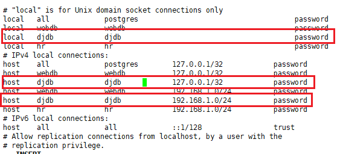


**[4]** 연결 확인

> 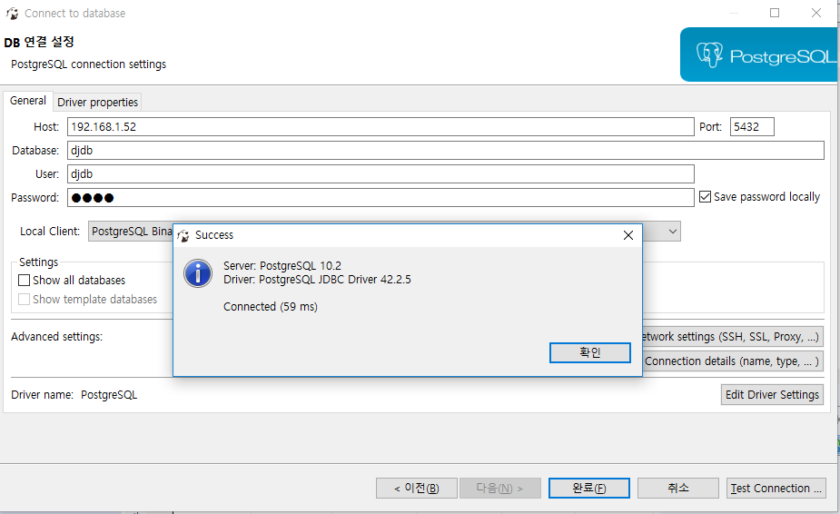


## **pycharm에서 Django 시작하기**

## :open_file_folder:구조 

```
1) 프로젝트 
	개발 대상이 되는 전체 프로그램을 의미
	
2) 애플리케이션
	프로젝트를 여러 개의 기능으로 나누었을 때, 프로젝트 하위의 여러 서브 프로그램
	
3) 프로젝트 디렉토리와 애플리케이션 디렉토리를 구분해서 관리

4) 애플리케이션 단위로 프로젝트를 구성하고 프로젝트를 모아 더 큰 프로젝트를 구성하는 계층적 구조가 가능하다.
```


## :artificial_satellite: 시작 

### [1] pycharm 프로젝트 생성(python_ch3 프로젝트)

> 


### [2]  Django 설치

[터미널]

```shell
pip install django
```

> 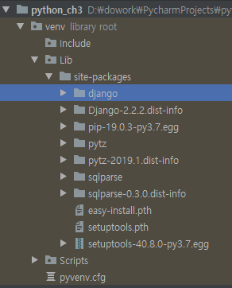


### [3] 장고 프로젝트 생성

[터미널]

```shell
django-admin startproject python_ch3
```

`django-admin startproject [python_ch3]` ​ :question:

> 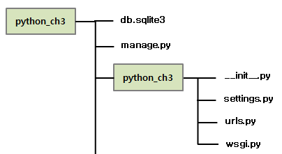

> 문제점 : 파이참 프로젝트 밑으로 들어가서 한단계 밑으로 내려갔어!
>
> 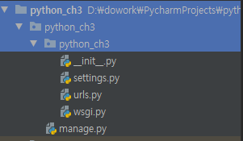


### [4] 디렉토리 정리

pycharm 프로젝트와 django프로젝트의 디렉토리를 일치 시키는 작업!

(그냥 한칸씩 상위 폴더로 옮기고 삭제하면 됨)

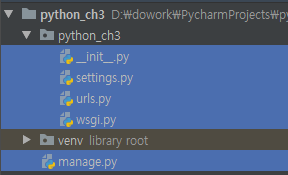


### [5] db(postgresql)사용 : psycopg2 설치

[터미널]

```shell
pip install psycopg2
```


### [6] settings.py 설정

**1) TIME_ZONE 설정**

```python
TIME_ZONE = 'Asia/Seoul'
```

**2) DATABASES 설정**

```python
DATABASES = {
    'default': {
        'ENGINE': 'django.db.backends.postgresql',
        'NAME': 'djdb',
        'USER': 'djdb',
        'PASSWORD': 'djdb',
        'HOST': '192.168.1.52',
        'PORT': 5432,
    }
}
```

**3)  TEMPLATES DIRS(디렉토리)설정**

```python
BASE_DIR = os.path.dirname(os.path.dirname(os.path.abspath(__file__)))
# 프로젝트의 위치!

TEMPLATES = [
    {
        ...
        'DIRS': [os.path.join(BASE_DIR, 'templates')],
        ...
    }
]
```

**4) templates 디렉토리 만들기**

> 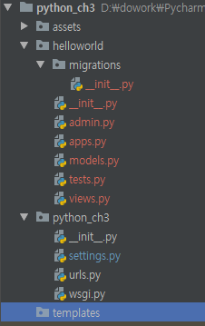


### [7] django project의 기본 관리 어플리케이션이 사용하는 테이블 생성

[터미널]

```shell
python manage.py migrate
```

> 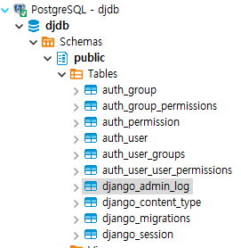


### [8] django project의 기본 관리 어플리케이션 로그인 계정 생성 

> 관리 계정 생성하기

[터미널]

```shell
python manage.py createsuperuser 
```


### [9] server start

[터미널]

```shell
python manage.py runserver 0.0.0.0:8888
```


> 


## :helicopter: **Application 작업**

## [ 장고 웹 애플리케이션 디자인 패턴 : MTV ]

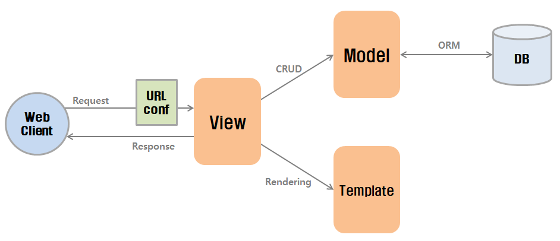


### [1] application 추가하기

[터미널]

```shell
python manage.py startapp helloworld
```

> 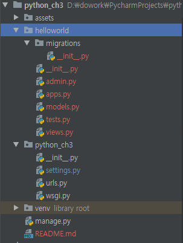


### [2] application 등록하기 (settings.py)

**INSTALLED_APPS**

```python
INSTALLED_APPS = [
    'helloworld',
    'django.contrib.admin',
    'django.contrib.auth',
    'django.contrib.contenttypes',
    'django.contrib.sessions',
    'django.contrib.messages',
    'django.contrib.staticfiles',
]
```


### [3] views.py에 등록   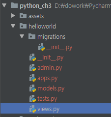

```python
def hello(request):
    return render(request, 'hello.html')
```


### [4] urls.py에 path등록   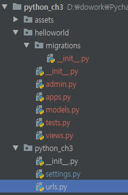

```python
import helloworld.views as helloworl_views

urlpatterns = [
    path('helloworld/', helloworl_views.hello),
    path('admin/', admin.site.urls),
]
```


### [5] templates에 html 만들기  


# 확인 :heavy_check_mark:


